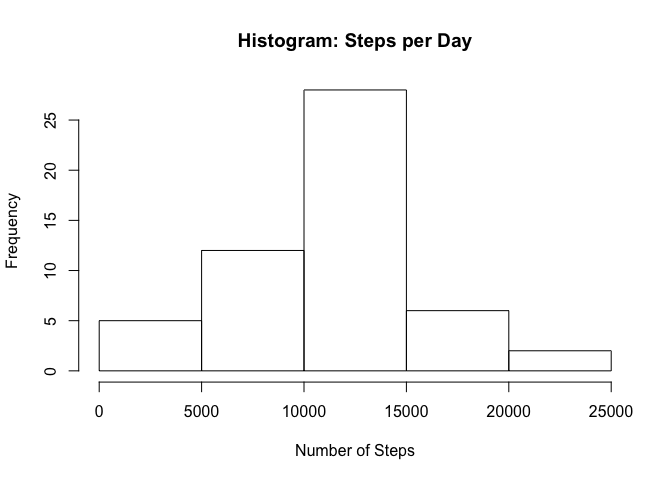
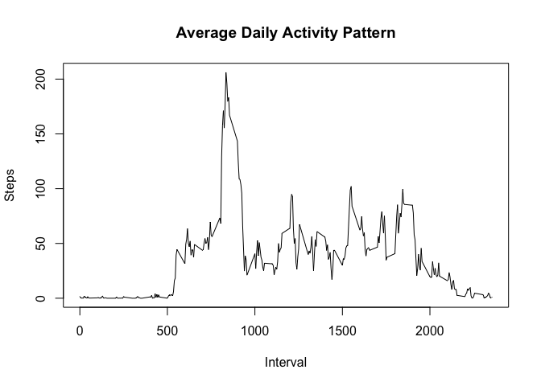
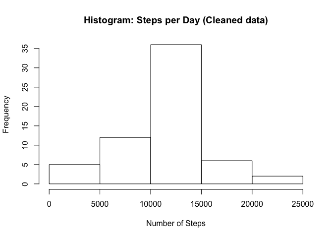
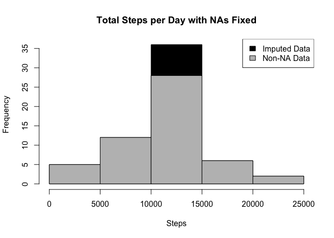
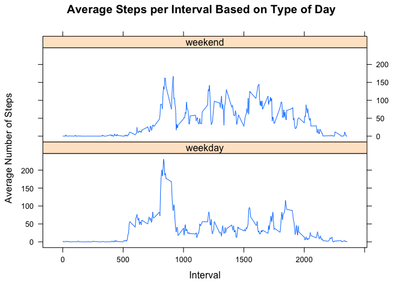

Importing Libraries

```r
library(ggplot2)
library(lattice) 
library(plyr)
```

## Loading and preprocessing the data


I will check if file exists else download it and unzip it. 

```r
if(!file.exists("activity.csv")){
     temp <- tempfile()
     download.file("https://d396qusza40orc.cloudfront.net/repdata%2Fdata%2Factivity.zip",temp)
     unzip(temp)
     unlink(temp)
}

activity <- read.csv("activity.csv", header = TRUE)
```


## What is mean total number of steps taken per day?

For this part of the assignment, you can ignore the missing values in the dataset.

### Calculate the total number of steps taken per day


```r
steps_per_day <- tapply(activity$steps,activity$date,sum)
```

### Make a histogram of the total number of steps taken each day

```r
hist(steps_per_day, xlab = "Number of Steps", main = "Histogram: Steps per Day")
```

<!-- -->


### Calculate and report the mean and median of the total number of steps taken per day


```r
mean_per_day <- mean(steps_per_day, na.rm = TRUE)
median_per_day <- median(steps_per_day, na.rm = TRUE)

print(paste("Mean Per Day =", mean_per_day))
```

```
## [1] "Mean Per Day = 10766.1886792453"
```

```r
print(paste("Median Per Day =", median_per_day))
```

```
## [1] "Median Per Day = 10765"
```

## What is the average daily activity pattern?


### Make a time series plot (i.e. \color{red}{\verb|type = "l"|}type="l") of the 5-minute interval (x-axis) and the average number of steps taken, averaged across all days (y-axis)


```r
steps_per_interval <- tapply(activity$steps,activity$interval,mean,na.rm=TRUE)

plot(as.numeric(names(steps_per_interval)), 
     steps_per_interval, 
     xlab = "Interval", 
     ylab = "Steps", 
     main = "Average Daily Activity Pattern", 
     type = "l")
```

<!-- -->


Which 5-minute interval, on average across all the days in the dataset, contains the maximum number of steps?


```r
max_interval <- names(sort(steps_per_interval, decreasing = TRUE)[1])
max_steps <- sort(steps_per_interval, decreasing = TRUE)[1]


print(paste("The interval associated with maximum steps is", max_interval, " with", round(max_steps), "steps"))
```

```
## [1] "The interval associated with maximum steps is 835  with 206 steps"
```

## Imputing missing values
*Note that there are a number of days/intervals where there are missing values (coded as \color{red}{\verb|NA|}NA). The presence of missing days may introduce bias into some calculations or summaries of the data.*


### Calculate and report the total number of missing values in the dataset (i.e. the total number of rows with \color{red}{\verb|NA|}NAs) ?


```r
na_vals <- sum(is.na(activity$steps))
na_vals
```

```
## [1] 2304
```


### Devise a strategy for filling in all of the missing values in the dataset. The strategy does not need to be sophisticated. For example, you could use the mean/median for that day, or the mean for that 5-minute interval, etc.


*I will fill in missing data with the mean number of steps across all days with available data for that particular interval.*

### Create a new dataset that is equal to the original dataset but with the missing data filled in.


```r
steps_per_interval <- tapply(activity$steps, activity$interval, mean, na.rm = TRUE)
activity_split <- split(activity, activity$interval)


for(i in 1:length(activity_split)){
    activity_split[[i]]$steps[is.na(activity_split[[i]]$steps)] <- steps_per_interval[i]
}
activity_replaced <- do.call("rbind", activity_split)
activity_replaced <- activity_replaced[order(activity_replaced$date) ,]
```

### Make a histogram of the total number of steps taken each day and Calculate and report the mean and median total number of steps taken per day


```r
steps_per_day_replaced <- tapply(activity_replaced$steps,activity_replaced$date, sum)


hist(steps_per_day_replaced,  xlab = "Number of Steps", main = "Histogram: Steps per Day (Cleaned data)")
```

<!-- -->


*Mean and median total number of steps taken per day*


```r
mean_perday_cleaned <- mean(steps_per_day_replaced, na.rm = TRUE)
median_perday_cleaned <- median(steps_per_day_replaced, na.rm = TRUE)

print(paste("Mean Per Day =", mean_perday_cleaned))
```

```
## [1] "Mean Per Day = 10766.1886792453"
```

```r
print(paste("Median Per Day =", median_perday_cleaned))
```

```
## [1] "Median Per Day = 10766.1886792453"
```

*Do these values differ from the estimates from the first part of the assignment? What is the impact of imputing missing data on the estimates of the total daily number of steps?*


```r
hist(steps_per_day_replaced, xlab="Steps", main = "Total Steps per Day with NAs Fixed", col="Black")
hist(steps_per_day, xlab="Steps", main = "Total Steps per Day with NAs Fixed", col="Grey", add=T)
legend("topright", c("Imputed Data", "Non-NA Data"), fill=c("black", "grey") )
```

<!-- -->


## Are there differences in activity patterns between weekdays and weekends?


### Create a new factor variable in the dataset with two levels - “weekday” and “weekend” indicating whether a given date is a weekday or weekend day.


```r
activity_replaced$day <- ifelse(weekdays(as.Date(activity_replaced$date)) == "Saturday" | weekdays(as.Date(activity_replaced$date)) == "Sunday", "weekend", "weekday")
```

### Make a panel plot containing a time series plot (i.e. type = “l”) of the 5-minute interval (x-axis) and the average number of steps taken, averaged across all weekday days or weekend days (y-axis).


```r
interval_table <- ddply(activity_replaced, .(interval, day), summarize, Avg = mean(steps))

xyplot(Avg~interval|day, data=interval_table, type="l",  layout = c(1,2),
       main="Average Steps per Interval Based on Type of Day", 
       ylab="Average Number of Steps", xlab="Interval")
```

<!-- -->

